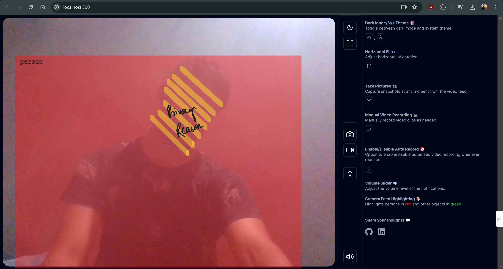

# AI-Powered Web App

## Overview

This web application is powered by AI and built using ShadcnUI and Next.js 14. It incorporates various technologies such as TensorFlowJS for machine learning capabilities and TailwindCSS for styling. The main features of this application include people detection, recording, dark mode, audio notifications, animations, volume control, social handles integration, image capture, and deployment options.

## Features

- **People Detection**: Utilizes TensorFlowJS and the cocossd model for real-time people detection.
- **Recording**: Allows users to record video directly from their webcam.
- **Dark Mode**: Supports both light and dark themes for user preference.
- **Audio Notifications**: Plays sounds for notifications to enhance user experience.
- **Animations**: Adds animations to buttons and other UI components for visual appeal.
- **Volume Slider**: Includes a popover component for adjusting volume settings.
- **Social Handles**: Provides links to various social media handles for connectivity.
- **Image Capture**: Enables users to capture images from the webcam.
- **Deployment**: Offers options for deploying the application to various platforms.

## Getting Started

1. Clone the repository.
2. Install dependencies using `npm install`.
3. Run the application locally using `npm run dev`.
4. Explore the different features and functionalities.

## Dependencies

- ShadcnUI
- Next.js 14
- TensorFlowJS
- TailwindCSS

## Usage

1. Start the application by running `npm run dev`.
2. Haven't deployed but use any service to deploy.
3. Use the various features provided by the application.
4. Enjoy seamless people detection, recording, and other functionalities.

## Resource

- [Tutorial by Arcade Maple Youtube Channel](https://www.youtube.com/watch?v=NStucy_xte8)
